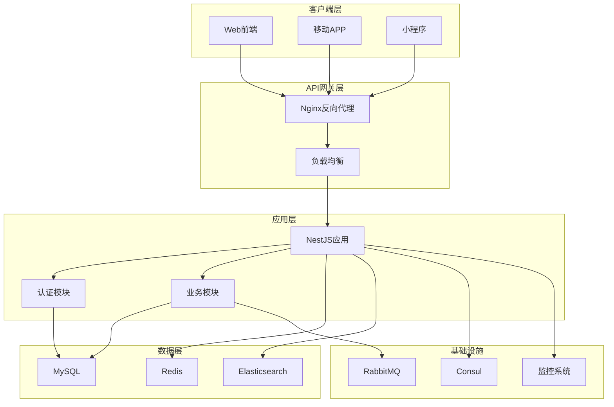

# MallEcoAPI - 企业级电商平台后端API

[](https://nestjs.com/)
[](https://www.typescriptlang.org/)
[](https://nodejs.org/)
[](https://www.docker.com/)
[](LICENSE)

一个功能完整、架构先进的企业级B2B2C电商平台后端API系统，采用现代化的微服务架构，提供完整的电商业务解决方案。

## 📋 目录

- [项目概述](#项目概述)
- [技术栈](#技术栈)
- [系统架构](#系统架构)
- [功能模块](#功能模块)
- [快速开始](#快速开始)
- [环境配置](#环境配置)
- [部署指南](#部署指南)
- [API文档](#api文档)
- [数据库设计](#数据库设计)
- [开发指南](#开发指南)
- [监控运维](#监控运维)
- [常见问题](#常见问题)
- [贡献指南](#贡献指南)

## 🎯 项目概述

MallEcoAPI是一个基于NestJS框架构建的企业级电商平台后端系统，采用TypeScript开发，支持高并发、高可用的生产环境部署。系统集成了完整的电商业务功能，包括商品管理、订单处理、支付系统、用户管理、营销推广等核心模块。

### 核心特性

- ✅ **微服务架构**：模块化设计，松耦合，易于扩展
- ✅ **多角色用户体系**：支持买家、卖家、管理员等多角色
- ✅ **完整支付集成**：支付宝、微信支付多渠道支付
- ✅ **高性能搜索**：Elasticsearch全文搜索
- ✅ **实时通讯**：WebSocket支持即时消息推送
- ✅ **直播带货**：完整的直播电商功能
- ✅ **分销系统**：多级分销，佣金管理
- ✅ **安全防护**：JWT认证、RBAC权限控制、数据加密
- ✅ **监控告警**：完整的监控和日志系统
- ✅ **容器化部署**：Docker + Kubernetes支持

## 🛠 技术栈

### 后端框架
- **NestJS 11.x** - Node.js企业级应用框架
- **TypeScript 5.x** - 类型安全的JavaScript超集
- **Express.js** - HTTP服务器框架

### 数据存储
- **MySQL 8.0** - 主数据库，存储核心业务数据
- **Redis 7.0** - 缓存数据库，提供高速缓存和会话存储
- **Elasticsearch 8.x** - 搜索引擎，提供全文搜索能力

### 消息队列
- **RabbitMQ 3.11+** - 异步消息处理

### 服务发现
- **Consul 1.16+** - 服务注册与发现

### 认证安全
- **JWT (jsonwebtoken)** - 无状态身份认证
- **BCrypt** - 密码加密
- **Helmet** - 安全头部设置
- **Rate Limiting** - API访问频率限制

### 支付集成
- **支付宝SDK** - 支付宝支付接口
- **微信支付** - 微信支付接口

### 云服务
- **阿里云SMS** - 短信服务
- **腾讯云服务** - 云服务集成

### 开发工具
- **Docker & Docker Compose** - 容器化
- **Jest** - 单元测试
- **ESLint & Prettier** - 代码规范
- **Swagger** - API文档自动生成

## 🏗 系统架构



## 📦 功能模块

### 🛍 核心电商功能

#### 商品管理系统
- 商品CRUD操作
- 商品分类和品牌管理
- 库存管理和预警
- 商品规格和属性管理
- 商品搜索和推荐
- 商品评价系统

#### 订单管理系统
- 订单创建和状态管理
- 订单分表存储（大数据量支持）
- 订单项处理和计算
- 购物车管理
- 订单统计和分析
- 退款和售后处理

#### 支付系统
- 多渠道支付集成（支付宝、微信支付）
- 支付回调处理和验证
- 交易记录管理
- 支付安全验证
- 退款处理
- 支付统计分析

#### 用户管理系统
- 多角色用户体系（买家、卖家、管理员）
- 用户注册和认证
- 权限控制（RBAC）
- 用户信息管理
- 用户行为分析
- 用户等级和积分系统

### 📈 营销推广功能

#### 促销系统
- 优惠券管理
- 满减活动
- 限时折扣
- 拼团活动
- 营销活动管理

#### 分销系统
- 多级分销网络
- 佣金管理和结算
- 分销商管理
- 推广链接和二维码
- 分销统计和报表

#### 内容系统
- 文章管理
- 内容分类和标签
- 内容发布和审核
- SEO优化
- 内容统计分析

### 🎥 互动服务功能

#### 直播系统
- 直播间管理
- 直播带货
- 实时互动功能
- 直播数据统计
- 礼物和打赏

#### 即时通讯
- 消息推送
- 客服系统
- 用户聊天
- 消息历史
- 群组管理

#### 物流系统
- 物流跟踪
- 发货管理
- 物流配置
- 配送状态更新
- 物流统计分析

### 📊 管理分析功能

#### 统计系统
- 销售统计和分析
- 用户行为统计
- 订单统计分析
- 财务统计报表
- 数据可视化

#### 监控系统
- 性能监控
- 业务监控
- 系统健康检查
- 告警通知
- 日志管理

## 🚀 快速开始

### 环境要求

- **Node.js** >= 20.0.0
- **MySQL** >= 8.0
- **Redis** >= 7.0
- **Elasticsearch** >= 8.x
- **RabbitMQ** >= 3.11
- **Docker** >= 20.10
- **Docker Compose** >= 2.0

### 本地开发环境

1. **克隆项目**
```bash
git clone https://github.com/your-repo/MallEcoAPI.git
cd MallEcoAPI
```

2. **安装依赖**
```bash
npm install
```

3. **环境配置**
```bash
cp config/.env.example config/.env
# 编辑 config/.env 文件，配置数据库等信息
```

4. **启动基础服务**
```bash
docker-compose up -d mysql redis elasticsearch rabbitmq consul
```

5. **数据库初始化**
```bash
npm run db:migrate
npm run db:seed
```

6. **启动开发服务器**
```bash
npm run start:dev
```

7. **访问服务**
- API服务：http://localhost:3000
- API文档：http://localhost:3000/api-docs
- 管理后台：http://localhost:3000/admin

### Docker快速启动

```bash
# 启动完整环境
docker-compose up -d

# 仅启动开发环境
docker-compose -f docker-compose.dev.yml up -d

# 生产环境
docker-compose -f docker-compose.prod.yml up -d
```

## ⚙️ 环境配置

### 环境变量配置

在 `config/.env` 文件中配置以下环境变量：

```env
# 应用配置
NODE_ENV=development
PORT=3000
API_PREFIX=api

# 数据库配置
DB_HOST=localhost
DB_PORT=3306
DB_USERNAME=root
DB_PASSWORD=your_password
DB_DATABASE=mall_eco
DB_SYNCHRONIZE=true

# Redis配置
REDIS_HOST=localhost
REDIS_PORT=6379
REDIS_PASSWORD=
REDIS_DB=0

# JWT配置
JWT_SECRET=your_jwt_secret_key
JWT_EXPIRES_IN=7d

# 支付配置
ALIPAY_APP_ID=your_alipay_app_id
ALIPAY_PRIVATE_KEY=your_alipay_private_key
ALIPAY_PUBLIC_KEY=your_alipay_public_key
WECHAT_APP_ID=your_wechat_app_id
WECHAT_MCH_ID=your_wechat_mch_id
WECHAT_API_KEY=your_wechat_api_key

# 云服务配置
ALIYUN_ACCESS_KEY_ID=your_aliyun_access_key
ALIYUN_ACCESS_KEY_SECRET=your_aliyun_secret_key
ALIYUN_SMS_SIGN_NAME=your_sms_sign
```

### 数据库配置

系统支持多数据库配置，通过环境变量进行切换：

```typescript
// config/database.ts
export const databaseConfig = {
  type: 'mysql',
  host: process.env.DB_HOST,
  port: parseInt(process.env.DB_PORT, 10),
  username: process.env.DB_USERNAME,
  password: process.env.DB_PASSWORD,
  database: process.env.DB_DATABASE,
  entities: ['dist/**/*.entity{.ts,.js}'],
  synchronize: process.env.NODE_ENV === 'development',
  logging: process.env.NODE_ENV === 'development',
};
```

## 🚀 部署指南

### 生产环境部署

#### 1. 服务器准备

```bash
# 安装Docker和Docker Compose
curl -fsSL https://get.docker.com -o get-docker.sh
sh get-docker.sh

# 安装Docker Compose
sudo curl -L "https://github.com/docker/compose/releases/download/v2.12.2/docker-compose-$(uname -s)-$(uname -m)" -o /usr/local/bin/docker-compose
sudo chmod +x /usr/local/bin/docker-compose
```

#### 2. 应用部署

```bash
# 克隆代码
git clone https://github.com/your-repo/MallEcoAPI.git
cd MallEcoAPI

# 配置生产环境变量
cp config/.env.example config/.env.prod
# 编辑生产环境配置

# 构建和启动服务
docker-compose -f docker-compose.prod.yml up -d

# 查看服务状态
docker-compose -f docker-compose.prod.yml ps
```

#### 3. Nginx配置

```nginx
# /etc/nginx/sites-available/mall-eco-api
server {
    listen 80;
    server_name api.your-domain.com;

    location / {
        proxy_pass http://localhost:3000;
        proxy_set_header Host $host;
        proxy_set_header X-Real-IP $remote_addr;
        proxy_set_header X-Forwarded-For $proxy_add_x_forwarded_for;
        proxy_set_header X-Forwarded-Proto $scheme;
    }

    location /api-docs {
        proxy_pass http://localhost:3000/api-docs;
    }
}
```

#### 4. SSL证书配置（推荐）

```bash
# 使用Let's Encrypt免费SSL证书
sudo apt-get install certbot python3-certbot-nginx
sudo certbot --nginx -d api.your-domain.com
```

### Kubernetes部署

```yaml
# k8s/deployment.yaml
apiVersion: apps/v1
kind: Deployment
metadata:
  name: mall-eco-api
spec:
  replicas: 3
  selector:
    matchLabels:
      app: mall-eco-api
  template:
    metadata:
      labels:
        app: mall-eco-api
    spec:
      containers:
      - name: mall-eco-api
        image: mall-eco-api:latest
        ports:
        - containerPort: 3000
        env:
        - name: NODE_ENV
          value: "production"
        - name: DB_HOST
          value: "mysql-service"
        # ... 其他环境变量
---
apiVersion: v1
kind: Service
metadata:
  name: mall-eco-api-service
spec:
  selector:
    app: mall-eco-api
  ports:
  - protocol: TCP
    port: 80
    targetPort: 3000
  type: LoadBalancer
```

## 📚 API文档

### 认证接口

```typescript
// POST /api/auth/login
interface LoginRequest {
  username: string;
  password: string;
}

interface LoginResponse {
  access_token: string;
  refresh_token: string;
  user: UserInfo;
}
```

### 商品接口

```typescript
// GET /api/goods
interface GoodsListRequest {
  page: number;
  limit: number;
  category_id?: number;
  keyword?: string;
}

interface GoodsResponse {
  id: number;
  name: string;
  price: number;
  description: string;
  images: string[];
  category: CategoryInfo;
}
```

### 订单接口

```typescript
// POST /api/orders
interface CreateOrderRequest {
  items: OrderItem[];
  address_id: number;
  payment_method: string;
}

interface OrderResponse {
  id: number;
  order_no: string;
  total_amount: number;
  status: OrderStatus;
  items: OrderItem[];
}
```

### 在线文档

启动服务后，访问以下地址查看完整的API文档：

- **Swagger UI**: http://localhost:3000/api-docs
- **OpenAPI JSON**: http://localhost:3000/api-docs-json

## 🗄 数据库设计

### 核心数据表

#### 用户相关
- `users` - 用户基础信息
- `members` - 会员信息
- `buyers` - 买家信息
- `sellers` - 卖家信息
- `managers` - 管理员信息

#### 商品相关
- `goods` - 商品信息
- `products` - 商品SKU
- `categories` - 商品分类
- `brands` - 品牌信息
- `goods_attributes` - 商品属性

#### 订单相关
- `orders` - 订单主表
- `order_items` - 订单明细
- `shopping_cart` - 购物车
- `order_logs` - 订单日志

#### 支付相关
- `payment_records` - 支付记录
- `payment_methods` - 支付方式
- `refunds` - 退款记录

#### 权限相关
- `roles` - 角色表
- `permissions` - 权限表
- `role_permissions` - 角色权限关联
- `departments` - 部门表

### 数据库迁移

```bash
# 创建新的迁移文件
npm run migration:create -- -n CreateUserTable

# 运行迁移
npm run db:migrate

# 回滚迁移
npm run db:rollback

# 生成种子数据
npm run db:seed
```

### 性能优化

- **索引优化**: 为常用查询字段添加索引
- **分表策略**: 大数据量表采用分表存储
- **读写分离**: 主从数据库配置
- **缓存策略**: Redis缓存热点数据

## 💻 开发指南

### 项目结构

```
src/
├── main.ts                    # 应用程序入口点
├── app.module.ts              # 根模块
├── common/                    # 公共组件
│   ├── decorators/           # 装饰器
│   ├── dto/                  # 数据传输对象
│   ├── entities/             # 实体类
│   ├── exceptions/           # 异常处理
│   └── pipes/               # 管道
├── config/                   # 配置文件
├── infrastructure/           # 基础设施层
├── modules/                   # 业务模块
│   ├── auth/                # 认证模块
│   ├── goods/               # 商品模块
│   ├── orders/              # 订单模块
│   ├── payment/             # 支付模块
│   └── ...                  # 其他模块
└── shared/                    # 共享工具
    ├── interceptors/        # 拦截器
    ├── guards/              # 守卫
    └── utils/               # 工具函数
```

### 开发规范

#### 代码规范

```typescript
// 使用TypeScript严格模式
// 文件名使用kebab-case
// 类名使用PascalCase
// 函数名使用camelCase
// 常量使用UPPER_SNAKE_CASE
```

#### Git规范

```bash
# 提交信息格式
git commit -m "type(scope): description"

# type类型
feat: 新功能
fix: 修复bug
docs: 文档更新
style: 代码格式调整
refactor: 代码重构
test: 测试相关
chore: 构建或工具相关
```

#### 测试

```bash
# 运行所有测试
npm test

# 运行测试并生成覆盖率报告
npm run test:cov

# 运行特定测试文件
npm test -- auth.service.spec.ts
```

### 调试技巧

#### VS Code调试配置

```json
{
  "type": "node",
  "request": "launch",
  "name": "Debug NestJS",
  "program": "${workspaceFolder}/src/main.ts",
  "preLaunchTask": "tsc: build - tsconfig.json",
  "outFiles": ["${workspaceFolder}/dist/**/*.js"],
  "env": {
    "NODE_ENV": "development"
  }
}
```

## 📊 监控运维

### 性能监控

系统集成了完整的监控方案：

#### Prometheus指标收集

```typescript
// 自定义指标
import { Counter, Histogram } from 'prom-client';

export const httpRequestsTotal = new Counter({
  name: 'http_requests_total',
  help: 'Total number of HTTP requests',
  labelNames: ['method', 'route', 'status_code'],
});

export const httpRequestDuration = new Histogram({
  name: 'http_request_duration_seconds',
  help: 'HTTP request duration in seconds',
  labelNames: ['method', 'route'],
});
```

#### 日志管理

```typescript
// Winston日志配置
import { WinstonModule } from 'nest-winston';

export const loggerConfig = WinstonModule.createLogger({
  level: 'info',
  format: winston.format.combine(
    winston.format.timestamp(),
    winston.format.json()
  ),
  transports: [
    new winston.transports.File({ filename: 'logs/error.log', level: 'error' }),
    new winston.transports.File({ filename: 'logs/combined.log' }),
  ],
});
```

### 健康检查

```typescript
// 健康检查端点
@Get('health')
getHealth() {
  return {
    status: 'ok',
    timestamp: new Date().toISOString(),
    uptime: process.uptime(),
    memory: process.memoryUsage(),
  };
}
```

### 错误处理

```typescript
// 全局异常过滤器
@Catch()
export class AllExceptionsFilter implements ExceptionFilter {
  catch(exception: unknown, host: ArgumentsHost) {
    const ctx = host.switchToHttp();
    const response = ctx.getResponse<Response>();
    const status = exception instanceof HttpException 
      ? exception.getStatus() 
      : HttpStatus.INTERNAL_SERVER_ERROR;
    
    response.status(status).json({
      statusCode: status,
      timestamp: new Date().toISOString(),
      message: exception instanceof Error ? exception.message : 'Internal server error',
    });
  }
}
```

## ❓ 常见问题

### Q1: 如何重置管理员密码？

```bash
# 进入容器
docker-compose exec app bash

# 重置密码
npm run reset-admin-password -- --new-password=your_new_password
```

### Q2: 如何备份数据库？

```bash
# 备份数据库
docker-compose exec mysql mysqldump -u root -p mall_eco > backup_$(date +%Y%m%d_%H%M%S).sql

# 恢复数据库
docker-compose exec -T mysql mysql -u root -p mall_eco < backup_file.sql
```

### Q3: 如何扩展服务实例？

```yaml
# docker-compose.yml
services:
  app:
    image: mall-eco-api
    deploy:
      replicas: 3  # 扩展到3个实例
```

### Q4: 如何查看服务日志？

```bash
# 查看所有服务日志
docker-compose logs

# 查看特定服务日志
docker-compose logs app

# 实时查看日志
docker-compose logs -f app
```

### Q5: 如何更新依赖？

```bash
# 检查过时的依赖
npm outdated

# 更新依赖
npm update

# 安全审计
npm audit fix
```

## 🤝 贡献指南

我们欢迎所有形式的贡献！请遵循以下步骤：

### 开发流程

1. **Fork项目**到你的GitHub账户
2. **创建功能分支**: `git checkout -b feature/amazing-feature`
3. **提交更改**: `git commit -m 'Add some amazing feature'`
4. **推送分支**: `git push origin feature/amazing-feature`
5. **创建Pull Request**

### 提交规范

请遵循[Conventional Commits](https://www.conventionalcommits.org/)规范：

```
feat: 添加新功能
fix: 修复bug
docs: 更新文档
style: 代码格式调整
refactor: 代码重构
test: 添加或修改测试
chore: 构建或工具相关
```

### 代码审查

所有PR都需要通过代码审查，确保：
- 代码符合项目规范
- 包含适当的测试
- 文档已更新
- 通过所有CI检查

### 问题报告

如果发现bug或有功能建议，请在GitHub Issues中创建issue，包含：
- 详细的问题描述
- 复现步骤
- 期望的行为
- 实际的行为
- 环境信息

## 📄 许可证

本项目采用 MIT 许可证 - 查看 [LICENSE](LICENSE) 文件了解详情。

## 🙏 致谢

感谢以下开源项目和服务：

- [NestJS](https://nestjs.com/) - 优秀的Node.js框架
- [TypeScript](https://www.typescriptlang.org/) - JavaScript的超集
- [MySQL](https://www.mysql.com/) - 可靠的关系型数据库
- [Redis](https://redis.io/) - 高性能内存数据库
- [Elasticsearch](https://www.elastic.co/) - 强大的搜索引擎
- [Docker](https://www.docker.com/) - 容器化平台

## 📞 联系方式

- **项目维护者**: [Your Name](mailto:your.email@example.com)
- **项目主页**: https://github.com/your-repo/MallEcoAPI
- **文档网站**: https://docs.your-domain.com
- **问题反馈**: https://github.com/your-repo/MallEcoAPI/issues

---

⭐ 如果这个项目对你有帮助，请给我们一个Star！